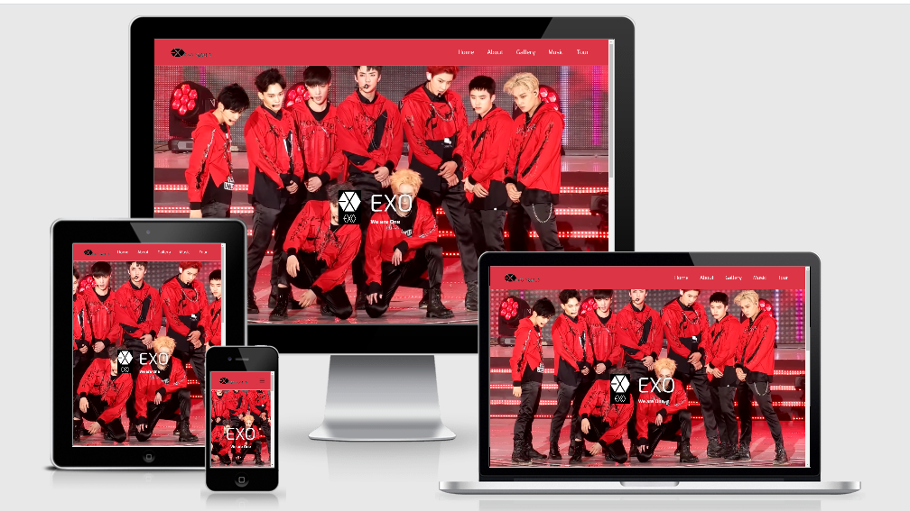

# EXO BAND .....We are One !!!

EXO is a South Korean – Chinese boy band created by Lee Soo Man,founder of SM Entertainment, in 2011. 
Originally formed of 8 Korean members and 4 Chinese members, the 12-member group showcased their official debut on April 8, 2012 with their first mini album Mama.
Mama peaked the South Korean Gaon Musical Chart and placed 8th on the Billboard World Albums Chart.

"This is a fan-run website honoring the "Kings of K-Pop" - EXO. The entire proceeds obtained through this website are dedicated to the Love ur Life foundation who works for the welfare and support of individuals fighting depression and suicidal tendencies. There is nothing more beautiful than being able to live this unique blessing of life to its entirety. And we hope with EXO and their songs it will be a bit more easy for those who have the hard fight every day."

## UX

The main aim of this band is to make sure the fans recieves updated information about the band and also to attract people those who are fond of music by giving opportunities to know about the band. In addition to that, it also provides link to buy recent albums in trend and about current events for those who wish to book tickets. In addition to that, the site also responds to those who are interested to book them for special occassions.

### User Stories

* As a hard core fan of the band, I need to get the updated information about the band's upcoming events to buy the tickets. Also I would like to know about the current trending albums and exact place to buy it. 

* As an ordinary user, I generally would like to know more about the band, their popular songs and all those details which makes me attracted more to the band.

## FEATURES

### Existing Features
* Home :- This page provides navigation all pages and in addition to that it gives a clear picture about the band. And provides links to ths social media used by the band.
* Gallery :- This takes the user to the popular clicks of the band in several ocassion.
* Music :- This provides the user to different popular video songs and concerts. Here, the user has an option to buy the most demanding videos now in sale.
* Tour :- This gives the information about the different events and concerts around the world and an opportunity to book the tickets. Added to that, it accepts the queries from the users to know about their availability to book for some special events like marriages or birthday parties etc.
### Features to be added in future
* Contact Page :- Right now, there is no direct contact with the band. It's just through mails. But an active toll free number and an address should be implemented in future. In accordance with that, details of an agency who takes care of the band should be included in the extension.
 
 ## TECHNOLOGIES USED
* HTML5 : The webpages are created using html with latest features. More information can be get from the site :- https://developer.mozilla.org/en-US/docs/Web/Guide/HTML/HTML5
* CSS3 : The styling of the pages like beautifying fonts, hovering effects, colouring etc. are done using an external css page. More information can be get from the site :- https://www.w3.org/Style/CSS/Overview.en.html
* Bootstrap 4 : The whole site is created using the mobile first Bootstrap framework to make it responsive and for the ease of doing the project. More information can be get from the site :- https://getbootstrap.com/
* Git : Git is a free and open source distributed version control system designed to handle everything from small to very large projects with speed and efficiency. More information can be obtained from this site :- https://git-scm.com/
* Github : GitHub brings the developers around the globe together and provides an environment to discover, share, and build better software.  More information can be obtained from this site :- https://github.com/
* Gitpod : Gitpod is an online IDE and it can be activated from any github pages. More information can be obtained from this site :- https://www.gitpod.io/
* Chrome DevTools : It is a set of built-in web development tools in google chrome browser and helps to identify and edit errors very firstly to make an error-free website. More information can be obtained from this site :- https://developers.google.com/web/tools/chrome-devtools
* W3C Markup Validation Service : It is a free W3C service which helps to validate the html and css codes to reduce the bugs pops up during the coding.  More information can be obtained from this site :- Validate your HTML via: https://validator.w3.org/
Validate your CSS via: https://jigsaw.w3.org/css-validator/
* Formatting Tool : I have used an online formatter for beautifying my html and css codes. More information can be obtained from this site :- https://www.freeformatter.com/
## TESTING
* Desktop : In the desktop, I have tested in chrome browser and internet explorer and understood that it works and all the links, modals, buttons and grid system are worked well with the browsers.
* Mobile : In the Mobile view, I have tested with iphone 6/7/8, iphone6/7/8 plus, galaxy s5, ipad and ipad pro and found it works responsive and resized acordingly.
* Responsiveness : I have tested the responsiveness of website with 1.http://ami.responsivedesign.is/ and found it is working flawlessly.
* Sign Up and Check Availability Button :
    1. Click on the respective buttons.
    2. Try to enter email address, if it is not in correct form, it will asked to enter in correct format.
    3. If you are missed any inputs in any text field and try to submit, it will asked to fill out the field first and press submit.

* Issues found : The main issue I have dealt with was the overflow issue as I could see some white spaces at the right end mainly while in the mobile view. But rectified using overflow element style elements.
## DEPLOYMENT
1. First we have to create an account in the github, that is in https://github.com/. The URL to my account is https://github.com/RenuVenugopal
2. Then I have created a repository called "milestoneproject-one" there. And it's URL is https://github.com/RenuVenugopal/milestoneproject-one to create my first milestone project and upload all the pages.
3. To publish the project for viewing it on the web, I went into the Settings on my respository, scrolled down to the heading, GitHub Pages. Under the Source setting, I clicked on the drop-down menu to select master branch as a publishing source and saved it. Refreshed the github page, and you are then given a url where your page is published; Your site is published at  https://renuvenugopal.github.io/milestoneproject-one/
4. To run this code on your local machine, you would go to my respository at https://github.com/RenuVenugopal/milestoneproject-one and on the home page on the right hand side just above all the files, you will see a green button that says, "Clone or download", this button will give you options to clone with HTTPS, open in desktop or download as a zip file. To continue with cloning, you would;
* Open Git Bash
* Change the current working directory to the location where you want the cloned directory to be made.
* Type git clone, and then paste this URL; https://github.com/RenuVenugopal/milestoneproject-one.git Press Enter. Your local clone will be created.

For more information about the above process; https://help.github.com/en/github/creating-cloning-and-archiving-repositories/cloning-a-repository

## CREDITS
### Content
1. I am mostly make use of bootstrap 4 documentation for getting the entire structure of the framework that has been used in different pages. That is https://getbootstrap.com/docs/4.0/getting-started/introduction/
2. I have been making use of google fonts to style my fonts. The link is https://fonts.google.com/
3. I have used the concept of navbar from a youtube tutorial that is https://www.youtube.com/watch?v=9cKsq14Kfsw&t=1479s (Responsive Bootstrap Website Start To Finish with Bootstrap 4, HTML5 & CSS3)
4. I also used the font awesome to make my pages more user friendly. The link is https://fontawesome.com/icons?d=gallery
5. I also make use of some hover effects to make my pages more impressive. The link is https://ianlunn.github.io/Hover/
6. I also used the text for the about section from the following site : https://www.allkpop.com/forum/threads/difference-between-exo-l-aeri-y-so-many-different-exo-fandom-names.294848/

### Media
1. All the pictures of the EXO band and their logo, I used are found out from the google images after the tedious effort of searching. And the link for images of EXO band is https://www.google.com/search?sxsrf=ALeKk0341s1vNJWJcHOLgzAXWKOyfw5xcw:1584139873016&q=exo+images&tbm=isch&source=univ&sa=X&ved=2ahUKEwj_-J7zxJjoAhWJvosKHYXfCsoQsAR6BAgKEAE
    and link for logo image is https://www.google.com/search?q=exo+logo&tbm=isch&ved=2ahUKEwjsrriqxZjoAhXNtyoKHfegClYQ2-cCegQIABAA&oq=exo+logo&gs_l=img.3..35i39l2j0j0i67j0l6.70044.71075..73074...0.0..0.134.385.3j1......0....1..gws-wiz-img.xWUjzn_cRns&ei=1A5sXuz0Ls3vqgH3waqwBQ
2. The videos also taken from a music lover's youtube channel who are the supporters of all the famous music bands especially in USA. The link is https://www.youtube.com/user/SMTOWN
3. I also used the link details of Amazon and Apple music in the music pages and the links are on the respective page itself. 
4. In addition to that, I have also used the different social media links.
5. I have gone through different tutorials like stackoverflow: https://stackoverflow.com/, W#Schools Online Web Tutorials: https://www.w3schools.com/ for getting ideas for designig the websites.

### ACKNOWLEDGEMENTS
* Code Institute Tutors: The tutors Anna, Samantha and Michael helped me a lot for doing this project. They always tried to give accurate reponses very quickly. 
* My Mentor: ADEGBENGA ADEYE is also very supportive and always guid me to move in the right track and open to all queries throughout the project.
* Code Institute Slack Channels: I also received lot of valuable information from it.
* Fiona Apple project: I received inspiration for this project is from the project which is done by a code institute student Aleesang. The link is https://aleesang.github.io/milestone-project-one
* My sister: The whole inspiration to select this band EXO for my milestone project comes from my sister Veena Venugopal, an undergraduate student in University of Texas Arlington, USA. She has helped me to understand more about the band and also their history and famous songs.
* Bob Herold: I have got an overall idea of Readme file from his file. 